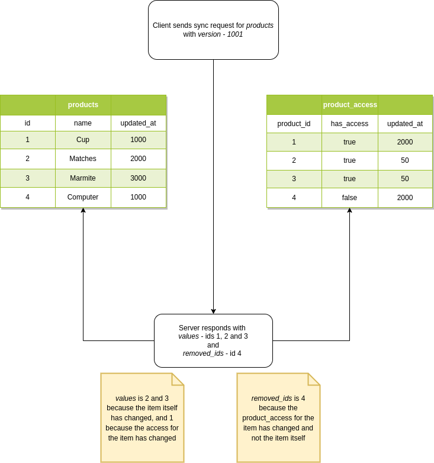
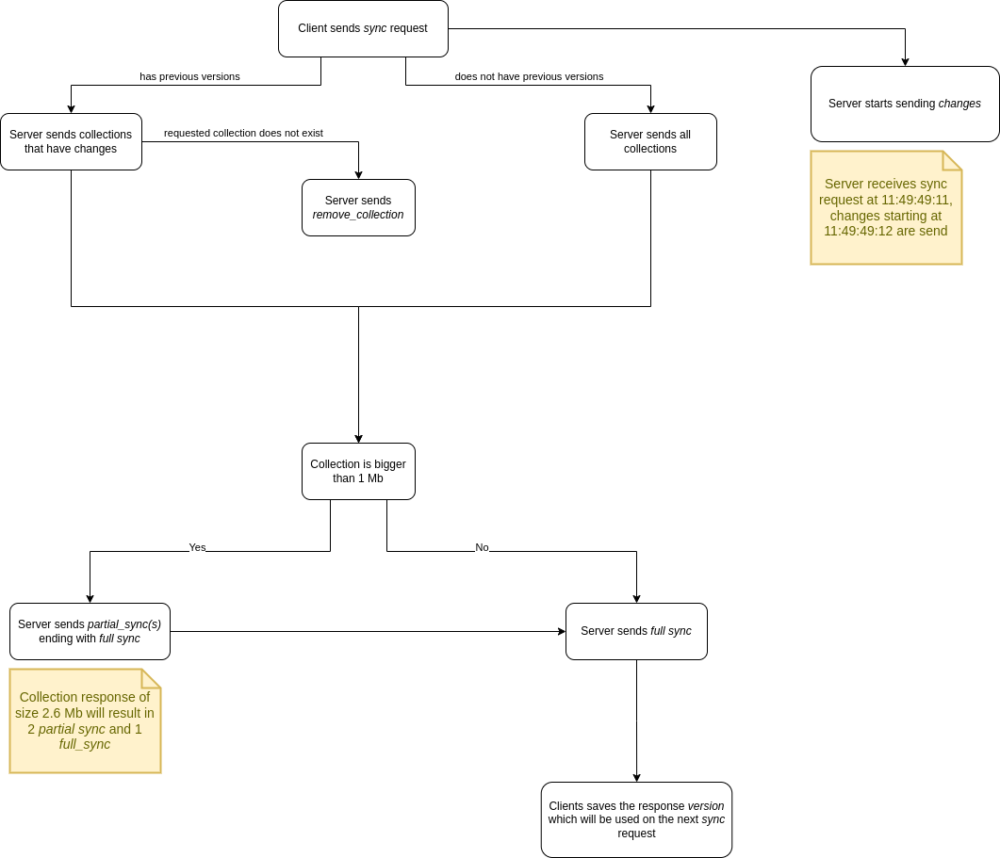

*The main differences between the original [RPR](https://github.com/0xB1a60/rpr) and RPRv2 are that in v2, WebSocket (WS) is replaced with Server-Sent Events (SSE), resulting in a simplified communication protocol. Additionally, the issue of inaccessible data, which previously had to remain in the server database indefinitely, is now resolved. RPRv2 is recommended due to its streamlined simplicity and lower server storage requirements*

# Realtime Persistent Replication 2 - RPRv2
Offline-first Realtime Persistent Replication Protocol

### Legend
1. Client - Web browser, mobile application, or desktop application
2. Server - An application handling all the logic on syncing, prioritizing, and storing data
3. Collection - A group of items of the same type (SQL - table, MongoDB - collection)
4. Item - An entry within a collection (SQL - row, MongoDB - document)

## Motivation
- Most web/mobile/desktop applications today make numerous HTTP fetch calls every time you open them to bootstrap the required data. As the application grows and new features are released, these calls multiply and can reach tens or hundreds
- Classic applications suffer from the 'stale data' problem where the Client (after a fetch) falls out of sync with the Server, potentially leading to Clients making incorrect decisions based on their current view
- Both Clients and Servers consume unnecessary bandwidth since requested data isn't cached, or caching isn't feasible due to frequent changes
- Offline support is absent in most HTTP fetch-based applications, resulting in a poor Client experience with even minor connection drops

## Proposal
- Instead of making tens or hundreds of fetch calls, RPRv2 employs a single HTTP SSE connection for background syncing, delivering the latest changes seamlessly and eliminating the 'stale data' issue
- To fully utilize RPRv2, web applications can employ IndexedDB, while mobile/desktop applications can use SQLite for persistent storage
- Offline support is inherently provided as data is persistently stored on the Client
- Client engineers are relieved of concerns about API versions, paging, and spinners (except in mutation calls), enabling them to focus on UX development
- The Server can prioritize data transmission (e.g., user details over notifications)
- Since data is stored on the Client, querying and aggregation are instant, reducing Server costs as a bonus

## Design
- The Client is permitted to use only one HTTP SSE connection at a time (e.g., during application bootstrapping). If it fails due to disconnection, connection must be retried until successful completion
- Response _full_sync_ may be preceded by _partial_sync_, but not the other way around
- While the Client is syncing, the Server can send the newest _change_ updates. For example, if the Client receives an item with ID "abcd1" and version 100 milliseconds before a change about "abcd1" and version 101 arrives, the Client should ignore the older version 100 and use the item from version 101
- The Client is not allowed to modify persistent data based on its needs (e.g., optimistic UI)
- Syncing can be disconnected at any time from both Server and Client, and the Client is expected to handle this gracefully. For instance, if the Server sends two _partial_sync_ followed by a _full_sync_, and the connection is lost after receiving the two _partial_sync_ messages, the Server will resend the items from those two _partial_sync_ messages upon reconnection
- The Server may send the same items that the Client already has. The Client should handle this gracefully. For instance, if a Client successfully syncs and a few _change_ events arrive, the same changes will be sent again as _values_ and/or _removed_ids_ in the next sync request
- _full_sync_ is always sent, even when both _values_ and _removed_ids_ are null. This allows the Client to track the _version_
- Property names from RPRv2 follow snake_case
- Communication between Client and Server is in JSON
- RPRv2 is language-agnostic, not tied to any specific database or programming language

### Keeping track of data access
The logic for _removed_ids_ depends on a static record that tracks whether the Client currently has access or has lost access and when such changes occurred, 
over time these static records can accumulate and occupy space unnecessarily



To address this issue, Revision Advancement (RA) is to be employed:
- The Server is responsible for maintaining an increasing *revision* number (timestamp may also be used) for each collection. This information is included in the _full_sync_
- On the Client side, the revision returned by _full_sync_ is persistently stored for each collection
- When the Server decides to purge stale data it must increment the revision associated with the affected collection. This ideally occurs within a transaction to ensure consistency
- Upon the next *_full_sync_*, if the Client detects a different revision for a collection compared to the locally stored one, it triggers a RA request to the Server. The Server responds with the updated revision, and the Client must remove item _ids_ from the RA response and save this new revision locally for subsequent use

ex.
1. Server responds with 2 _full_sync_, collection *ABC* with revision *2* and collection *DFG* with revision *2*
2. Client in persisted storage has collection ABC with revision *1* and collection *DFG* with revision *2*
3. Client sends RA for collection ABC, skipping collection *DFG* as the Client and Server revisions are equal
4. After Client receives the response from RA, the Client removes the items (_ids_) and saves collection *ABC* with revision *2*

## Communication protocol

### Data exchange (DE)

#### Client request
```json5
{
    // optional, set when the persistent storage contains collection and version
    "collection_versions": {
        // key - collection name
        // value - saved value from the full_sync response field 'version'
        string: number,
    }
}
```

ex:
```json5
{
    "collection_versions": {
        "collection_ABC": 1692001026,
        "collection_XYZ": 1692000026,
    }
}
```

#### Server responses as events
```json5
{
    // values: full_sync, partial_sync, change, remove_collection
    "type": one of values,
    
    "collection_name": string,
    
    ...other properties
}
```

_remove_collection_ is received when the Client has sent a request with the collection under 'collection_versions' that does not exist on Server (or the Client has lost access to it)
ex:
```json5
{
    "type": "remove_collection",
    "collection_name": "collection_OLD",
}
```

_change_ is received when an item inside of collection changes
ex:
```json5
{
    "type": "change",
    "collection_name": "collection_ABC",
    
    // values: create, update, remove
    "change_type": one of values,
    
    // unique id for the item
    "id": string,
    
    "version": timestamp as number,
   
    // null when change_type is create
    "before": the previous version of the item, 
    
    // null when change_type is remove
    "after": the current version of the item
}
```

ex:
```json5
{
    "type": "change",
    "collection_name": "collection_ABC",
    "change_type": "create",
    "id": "YHEEW2jMpvezDtNZCA6od",
    "version": 1701284829,
    "before": null,
    "after": {
      "id": "YHEEW2jMpvezDtNZCA6od",
      "created_at": 1701284829,
      "updated_at": 1701284829,
      "value": "chn"
    },
}
```

ex:
```json5
{
    "type": "change",
    "collection_name": "collection_ABC",
    "change_type": "update",
    "id": "YHEEW2jMpvezDtNZCA6od",
    "version": 1701284830,
    "before": {
      "id": "YHEEW2jMpvezDtNZCA6od",
      "created_at": 1701284829,
      "updated_at": 1701284829,
      "value": "chn"
    },
    "after": {
      "id": "YHEEW2jMpvezDtNZCA6od",
      "created_at": 1701284829,
      "updated_at": 1701284830,
      "value": "upt"
    },
}
```

ex:
```json5
{
    "type": "change",
    "collection_name": "collection_ABC",
    "change_type": "remove",
    "id": "YHEEW2jMpvezDtNZCA6od",
    "version": 1701284831,
    "before": {
      "id": "YHEEW2jMpvezDtNZCA6od",
      "created_at": 1701284829,
      "updated_at": 1701284830,
      "value": "upt"
    },
    "after": null,
}
```

Type _partial_sync_ is received when collection request cannot be fit into one message and the Server decides to split it into multiple in order to reduce Server and Client load and avoid memory errors

Whenever possible, have small collection of small items to avoid this case, splitting is recommended when sync response is bigger than 1 MB
```json5
{
    "type": "partial_sync",
    "collection_name": string,
    
    // optional, value is allowed to be null when there are no values
    // array of items from 'collection_name'
    "values": [{

        // unique id for the item
        "id": string,
        
        "version": timestamp as number,
        
        ...other properties of the item
    }, 
    {...}
    ]
}
```

ex:
```json5
{
    "type": "partial_sync",
    "collection_name": "collection_ABC",
    "values": [{
        "id": "1EwArGOcrPf3jxifIMFyx",
        "version": 1692013118,
        "name": "RPR",
        "tags": ["background", "seamless", "sync"],
        "created_on": "Sep 15, 2023"
    },
    {
        "id": "N8CZxDneZjoeRsNJRxxnR",
        "version": 2007632504,
        "name": "RPR 2.0",
        "tags": ["future"],
        "created_on": "Aug 11, 2027"
    }]
}
```

_full_sync_ is received when collection request has completed and all data for _collection_name_ has been sent to the Client
```json5
{
    "type": "full_sync",
    "collection_name": string,
    
    // timestamp when the sync request started, value is to be saved and used when sending DE request
    "version": timestamp as number,
  
    // number serving as an indicator for the Client to trigger Revision advancement (RA)
    // value is to be saved and checked for change
    "revision": number,

    // optional, value is allowed to be null when there are no values
    // array of items from 'collection_name'
    "values": [{

        // unique id for the item
        "id": string,
        
        "version": timestamp as number,
        
        ...other properties of the item
    }, 
    {...}
    ],
    
    // optional
    // item id - version (timestamp as number) to which the Client has lost access
    // ex. permission to an item has changed, item has been deleted
    "removed_ids": {
      "id": timestamp as number
    }
}
```

ex:
```json5
{
    "type": "full_sync",
    "collection_name": "collection_ABC",
    "version": 1692013118,
    "values": [{
        "id": "1EwArGOcrPf3jxifIMFyx",
        "version": 1692013118,
        "name": "RPR",
        "tags": ["background", "seamless", "sync"],
        "created_on": "Sep 15, 2023"
    },
    {
        "id": "N8CZxDneZjoeRsNJRxxnR",
        "version": 2007632504,
        "name": "RPR 2.0",
        "tags": ["future"],
        "created_on": "Aug 11, 2027"
    }],
    "removed_ids": {
    "GgFiZqN3SQpy8r9iHo9T8": 2007632504,
    "5mWL8TlRuqfS9jJDHV1SW": 1692013118,
    },
}
```

### Revision advancement (RA)

#### Client request
```json5
{
    "collection": string,
    // array of all item ids that are in the collection
    "ids": item id array
}
```

ex.
```json5
{
    "collection": "collection_ABC",
    "ids": [
      "1EwArGOcrPf3jxifIMFyx",
      "N8CZxDneZjoeRsNJRxxnR"
    ],
}
```

#### Server response
```json5
{
    // latest collection revision
    "revision": number,
  
    // optional, array of item ids that the Client has no longer access to
    "removed_ids": item id array
}
```

###### Diagram


## Implementation suggestions
- While SSE/JSON are not strict requirements, they work across all Clients and are simple to use. However, any transport/serialization protocol can be utilized
- When sending mutation calls, design the API to include the version of the item you're modifying (when applicable) to ensure data integrity
- For change responses, utilize the CDC (Change Data Capture) provided by the database (e.g., Data Change Notification Callbacks for SQLite, Change Streams for MongoDB, Change Data Capture/Listen-Notify for CockroachDB), rather than managing it in the code, to minimize engineering overhead

## Async transport not available
If the async transport (WS/SSE) is unavailable, the Server can fallback to a request-only endpoint. In this scenario, the Client would pull data at regular intervals, with the optimal frequency determined by the Server itself. It's important to note that this fallback mechanism sacrifices the ~~Realtime~~ Persistent Replication aspect originally provided by RPR

## Extensions suggestions
* Item integrity verifier - Since data is stored on the Client, data corruption could occur due to accidental writes or platform purging. The Client could send a verify request with each item ID and a checksum of the content. The Server can then respond accordingly
