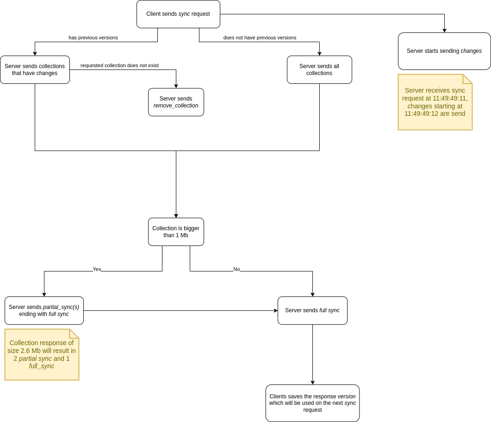
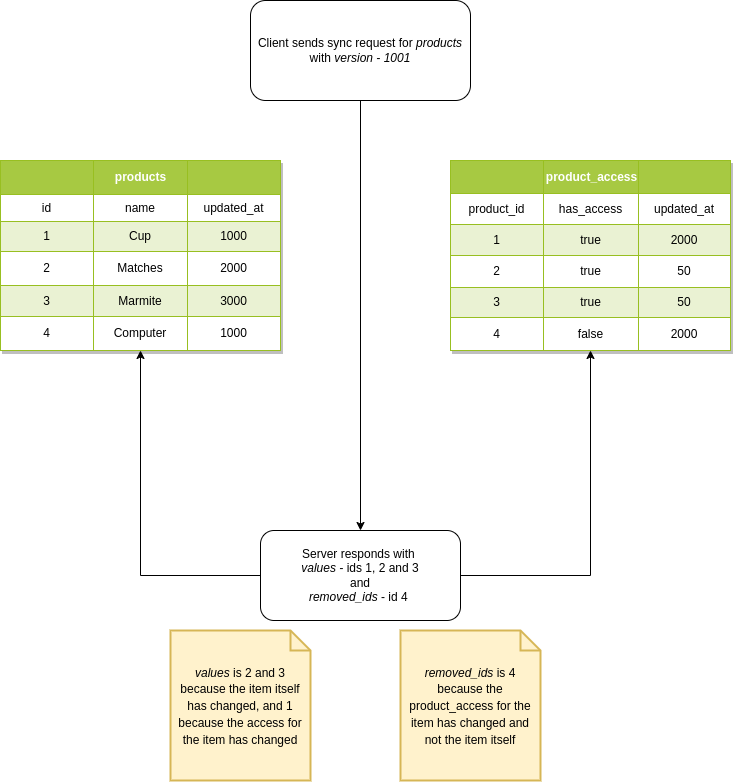

# Realtime Persistent Replication - RPR
Offline-first Realtime Persistent Replication Protocol

### Legend
1. Client - Web browser, mobile application, or desktop application
2. Server - An application handling all the logic on syncing, prioritizing, and storing data
3. Collection - A group of items of the same type (SQL - table, MongoDB - collection)
4. Item - An entry within a collection (SQL - row, MongoDB - document)

## Motivation
- Most web/mobile/desktop applications today make numerous HTTP fetch calls every time you open them to bootstrap the required data. As the application grows and new features are released, these calls multiply and can reach tens or hundreds
- Classic applications suffer from the 'stale data' problem where the Client (after a fetch) falls out of sync with the Server, potentially leading to users making incorrect decisions based on their current view
- Both users and servers consume unnecessary bandwidth since requested data isn't cached, or caching isn't feasible due to frequent changes
- Offline support is absent in most HTTP fetch-based applications, resulting in a poor user experience with even minor connection drops

## Proposal
- Instead of making tens or hundreds of fetch calls, RPR employs a single WebSocket (WS) connection for background syncing, delivering the latest changes seamlessly and eliminating the 'stale data' issue
- To fully utilize RPR, web applications can employ IndexedDB, while mobile/desktop applications can use SQLite for persistent storage
- Offline support is inherently provided as data is persistently stored on the Client
- Client engineers are relieved of concerns about API versions, paging, and spinners (except in mutation calls), enabling them to focus on UX development
- The server can prioritize data transmission (e.g., user details over notifications)
- Since data is stored on the Client, querying and aggregation are instant, reducing server costs as a bonus

## Design
- The Client is permitted to send only one _sync_ request at a time (e.g., during application bootstrapping). If a _sync_ fails due to disconnection, any number of _sync_ requests can be sent until successful completion
- Response _full_sync_ may be preceded by _partial_sync_, but not the other way around
- While the user is syncing, the server can send the newest _change_ updates. For example, if the Client receives an item with ID "abcd1" and version 100 milliseconds before a change about "abcd1" and version 101 arrives, the Client should ignore the older version 100 and use the item from version 101
- The Client is not allowed to modify persistent data based on its needs (e.g., optimistic UI)
- Syncing can be disconnected at any time from both Server and Client, and the Client is expected to handle this gracefully. For instance, if the Server sends two _partial_sync_ followed by a _full_sync_, and the connection is lost after receiving the two _partial_sync_ messages, the Server will resend the items from those two _partial_sync_ messages upon reconnection
- The Server may send the same items that the Client already has. The Client should handle this gracefully. For instance, if a Client successfully syncs and a few _change_ events arrive, the same changes will be sent again as _values_ and/or _removed_ids_ in the next sync request
- _full_sync_ is always sent, even when both _values_ and _removed_ids_ are null. This allows the Client to track the _version_
- Property names from RPR follow snake_case
- Communication between Client and Server is in JSON
- RPR is language-agnostic, not tied to any specific database or programming language


### Communication protocol

#### Client request
```json5
{
    "type": "sync",
    
    // optional, set when the persistent storage contains collection and version
    "collection_versions": {
        // key - collection name
        // value - saved value from the full_sync response field 'version'
        string: number,
    }
}
```

ex:
```json5
{
    "type": "sync",
    "collection_versions": {
        "collection_ABC": 1692001026,
        "collection_XYZ": 1692000026,
    }
}
```


#### Server responses
```json5
{
    // values: full_sync, partial_sync, change, remove_collection
    "type": one of values,
    
    "collection_name": string,
    
    ...other properties
}
```

_remove_collection_ is received when the Client has sent a _sync_ request with the collection under 'collection_versions' that does not exist on Server (or the Client has lost access to it)
ex:
```json5
{
    "type": "remove_collection",
    "collection_name": "collection_OLD",
}
```

_change_ is received when an item inside of collection changes
ex:
```json5
{
    "type": "change",
    "collection_name": "collection_ABC",
    
    // values: create, update, remove
    "change_type": one of values,
    
    // unique id for the item
    "id": string,
    
    "updated_at": timestamp as number,
   
    // null when change_type is create
    "before": the previous version of the item, 
    
    // null when change_type is remove
    "after": the current version of the item
}
```

ex:
```json5
{
    "type": "change",
    "collection_name": "collection_ABC",
    "change_type": "create",
    "id": "YHEEW2jMpvezDtNZCA6od",
    "updated_at": 1701284829,
    "before": null,
    "after": {
      "id": "YHEEW2jMpvezDtNZCA6od",
      "created_at": 1701284829,
      "updated_at": 1701284829,
      "value": "chn"
    },
}
```

ex:
```json5
{
    "type": "change",
    "collection_name": "collection_ABC",
    "change_type": "update",
    "id": "YHEEW2jMpvezDtNZCA6od",
    "updated_at": 1701284830,
    "before": {
      "id": "YHEEW2jMpvezDtNZCA6od",
      "created_at": 1701284829,
      "updated_at": 1701284829,
      "value": "chn"
    },
    "after": {
      "id": "YHEEW2jMpvezDtNZCA6od",
      "created_at": 1701284829,
      "updated_at": 1701284830,
      "value": "upt"
    },
}
```

ex:
```json5
{
    "type": "change",
    "collection_name": "collection_ABC",
    "change_type": "remove",
    "id": "YHEEW2jMpvezDtNZCA6od",
    "updated_at": 1701284831,
    "before": {
      "id": "YHEEW2jMpvezDtNZCA6od",
      "created_at": 1701284829,
      "updated_at": 1701284830,
      "value": "upt"
    },
    "after": null,
}
```

Type _partial_sync_ is received when collection _sync_ request cannot be fit into one message and the server decides to split it into multiple in order to reduce Server and Client load and avoid memory errors. 

Whenever possible, have small collection of small items to avoid this case, splitting is recommended when sync response is bigger than 1 MB
```json5
{
    "type": "partial_sync",
    "collection_name": string,
    
    // optional, value is allowed to be null when there are no values
    // array of items from 'collection_name'
    "values": [{

        // unique id for the item
        "id": string,
        
        "updated_at": timestamp as number,
        
        ...other properties of the item
    }, 
    {...}
    ]
}
```

ex:
```json5
{
    "type": "partial_sync",
    "collection_name": "collection_ABC",
    "values": [{
        "id": "1EwArGOcrPf3jxifIMFyx",
        "updated_at": 1692013118,
        "name": "RPR",
        "tags": ["background", "seamless", "sync"],
        "created_on": "Sep 15, 2023"
    },
    {
        "id": "N8CZxDneZjoeRsNJRxxnR",
        "updated_at": 2007632504,
        "name": "RPR 2.0",
        "tags": ["future"],
        "created_on": "Aug 11, 2027"
    }]
}
```

_full_sync_ is received when collection request has completed and all data for _collection_name_ has been sent to the client
```json5
{
    "type": "full_sync",
    "collection_name": string,
    
    // timestamp when the sync request started, value is to be saved and used when sending 'sync' request
    "version": timestamp as number,

    // optional, value is allowed to be null when there are no values
    // array of items from 'collection_name'
    "values": [{

        // unique id for the item
        "id": string,
        
        "updated_at": timestamp as number,
        
        ...other properties of the item
    }, 
    {...}
    ],
    
    // optional
    // item id - updated_at to which the Client has lost access
    // ex. permission to an item has changed, item has been deleted
    "removed_ids": {
      "id": timestamp as number
    }
}
```

ex:
```json5
{
    "type": "full_sync",
    "collection_name": "collection_ABC",
    "version": 1692013118,
    "values": [{
        "id": "1EwArGOcrPf3jxifIMFyx",
        "updated_at": 1692013118,
        "name": "RPR",
        "tags": ["background", "seamless", "sync"],
        "created_on": "Sep 15, 2023"
    },
    {
        "id": "N8CZxDneZjoeRsNJRxxnR",
        "updated_at": 2007632504,
        "name": "RPR 2.0",
        "tags": ["future"],
        "created_on": "Aug 11, 2027"
    }],
    "removed_ids": {
    "GgFiZqN3SQpy8r9iHo9T8": 2007632504,
    "5mWL8TlRuqfS9jJDHV1SW": 1692013118,
    },
}
```



###### Implementation suggestions
- While WS/JSON are not strict requirements, they work across all Clients and are simple to use. However, any transport/serialization protocol can be utilized
- For efficient removed_ids logic, a static record in a database is necessary to track when the Client loses access to items 
- When sending mutation calls, design the API to include the version of the item you're modifying (when applicable) to ensure data integrity
- For change responses, utilize the CDC (Change Data Capture) provided by the database (e.g., Data Change Notification Callbacks for SQLite, Change Streams for MongoDB, Change Data Capture/Listen-Notify for CockroachDB), rather than managing it in the code, to minimize engineering overhead

###### Extensions suggestions
* Item integrity verifier - Since data is stored on the Client, data corruption could occur due to accidental writes or platform purging. The Client could send a verify request with each item ID and a checksum of the content. The server can then respond accordingly
